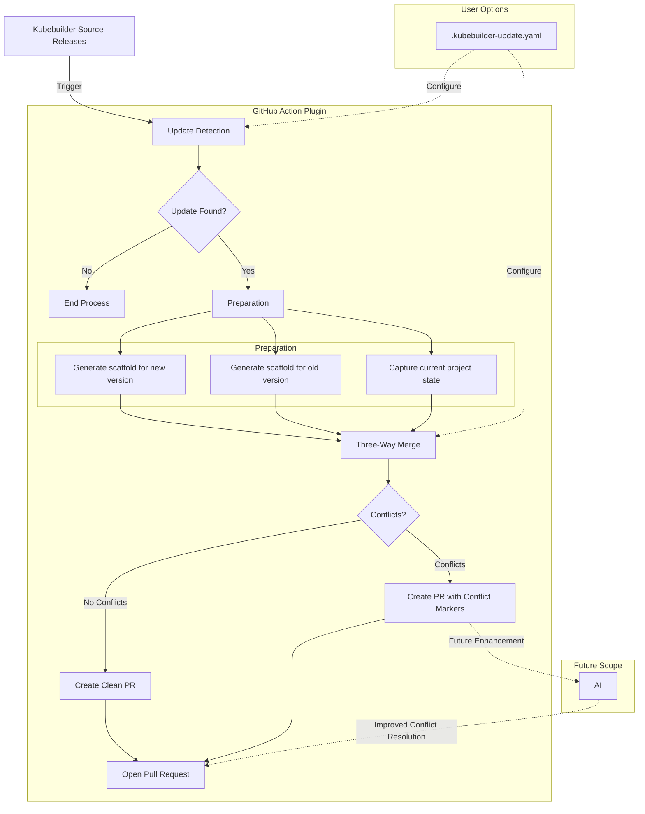
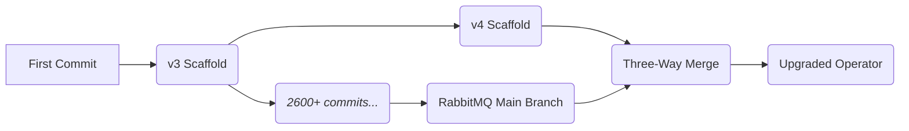

# Automating Operator Maintenance: Driving Better Results with Less Overhead

Proposal for Google Summer of Code (GSoC) 2025

- [Automating Operator Maintenance: Driving Better Results with Less Overhead](#automating-operator-maintenance-driving-better-results-with-less-overhead)
  - [Personal Details](#personal-details)
  - [Abstract](#abstract)
  - [Background](#background)
    - [The Maintenance Challenge](#the-maintenance-challenge)
    - [Impact of Outdated Scaffolds](#impact-of-outdated-scaffolds)
  - [About Me](#about-me)
  - [Technical Deep Dive](#technical-deep-dive)
    - [1. 3-Way Merge](#1-3-way-merge)
    - [2. AI-Assisted Conflict Resolution](#2-ai-assisted-conflict-resolution)
      - [Options Considered](#options-considered)
      - [Assumptions](#assumptions)
      - [Selected Approach: Code Embedding Model with AST Analysis](#selected-approach-code-embedding-model-with-ast-analysis)
      - [Why This Approach?](#why-this-approach)
  - [Plan of Action](#plan-of-action)
    - [Phase 1: Core Functionality \& Kubebuilder Plugin (Weeks 1-8)](#phase-1-core-functionality--kubebuilder-plugin-weeks-1-8)
    - [Phase 2: AI Integration, Monorepo Support \& Advanced Features (Weeks 9-12)](#phase-2-ai-integration-monorepo-support--advanced-features-weeks-9-12)
    - [Evaluation Metrics](#evaluation-metrics)
  - [UX Components:](#ux-components)
  - [Proof of Concept: Three-Way Merge in Action on RabbitMQ Operator](#proof-of-concept-three-way-merge-in-action-on-rabbitmq-operator)
    - [The Problem Solved](#the-problem-solved)
    - [Real Results from a Production Codebase](#real-results-from-a-production-codebase)
    - [Limitations \& Next Steps](#limitations--next-steps)
  - [Commitments](#commitments)
    - [Additional Information about the Timeline](#additional-information-about-the-timeline)
    - [Post-GSoC Plans](#post-gsoc-plans)


## Personal Details
|  |  |
| --- | --- |
| Name | Pranchal Shah |
| Email | pranchx@gmail.com |
| Location | Boston, Massachusetts, United States |
| Timezone | Eastern Time (US & Canada) |
| University | Northeastern University |
| Primary language | English |

## Abstract

Kubernetes operators built with Kubebuilder face a critical maintenance challenge: as the scaffolding framework evolves, projects struggle to stay current without tedious manual updates. This proposal introduces an automated three-way merge solution that seamlessly upgrades Kubebuilder projects while preserving customizations. By combining Git-aware merging strategies, conflict pattern recognition, and optional AI assistance, this approach generates pull requests that update scaffold code with minimal developer intervention. The resulting workflow not only reduces maintenance overhead but creates a more secure, sustainable ecosystem where Kubernetes operators can evolve alongside the rapidly changing cloud-native landscape.


## Background

Kubebuilder has emerged as the de facto standard for developing Kubernetes operators, providing a structured framework that abstracts away boilerplate code and enforces best practices. Since its introduction, it has evolved significantly, incorporating new Kubernetes APIs, controller-runtime improvements, and community-driven patterns that enhance operator stability and functionality.

### The Maintenance Challenge

While Kubebuilder excels at bootstrapping projects, it struggles with the "day two" problem: ongoing maintenance. When the framework releases new versions, projects face a difficult choice:

- **Remain on outdated scaffolds** - risking security vulnerabilities and missing performance improvements.
- **Manually re-scaffold and merge** - an error-prone, time-consuming process that often introduces regressions.
- **Start from scratch** - discarding valuable customizations and project history.

### Impact of Outdated Scaffolds

Outdated scaffolds aren't merely a cosmetic issue. They introduce concrete problems:

- Security vulnerabilities in deprecated dependencies.
- Incompatibility with newer Kubernetes APIs.
- Performance penalties from outdated controller patterns.
- Missed optimizations in error handling and reconciliation loops.
- Increasing divergence from community standards.

Each release cycle widens this gap, making eventual updates exponentially more difficult.

## About Me
Open-source software has always been more than just code to me - it represents a community of builders creating tools that impact millions of developers. My journey with Kubernetes began in 2023 when I implemented my first operator for managing custom database deployments during my internship.

What started as curiosity quickly turned into genuine enthusiasm for the ecosystem. I found myself diving deeper into Kubernetes internals, contributing to projects that seemed intimidating at first but became increasingly approachable as I spent more time with the community. The collaborative atmosphere and technical excellence I've encountered have only strengthened my commitment to meaningful contributions.

My contributions to the Kubernetes and Kubebuilder include:
- [#129574](https://github.com/kubernetes/kubernetes/pull/129574) (merged) - Add separate container runtime filesystem e2e tests, and some disk eviction scenarios
- [#34444](https://github.com/kubernetes/test-infra/pull/34444) (merged) - Update sig-node presubmit focus regex to match SeparateDisk tests
- [#34306](https://github.com/kubernetes/test-infra/pull/34306) (merged) - Add SeparateDisk flag to CI pipelines for testing infrastructure
- [#4713](https://github.com/kubernetes-sigs/kubebuilder/pull/4713) (merged) -  Fix hardcoded controller-runtime version in kubebuilder
- [#4720](https://github.com/kubernetes-sigs/kubebuilder/pull/4720) (open) - feat: Implement Bubbletea for Interactive CLI Prompts  

Previous experiences:
- Infrastructure intern at FoxyAI (Remote)
  - Architected infrastructure that processed 12M images/day for ML workloads
  - Implemented GitHub Actions workflows that reduced deployment time by 40%
  - Collaborated with distributed teams, strengthening my remote communication skills


I'm passionate about solving this specific problem because it represents a critical friction point that's holding back the entire Kubernetes operator ecosystem. By reducing the maintenance burden, we can enable developers to focus on building great solutions rather than wrestling with scaffold updates.

## Technical Deep Dive

### 1. 3-Way Merge
After researching Git's merge capabilities, I've found that three-way merges offer significant advantages over simple rebasing for Kubebuilder projects:
Why Three-Way Merge vs. Rebase:

- Rebasing loses the context of original changes
- Three-way merges preserve the intent of both original and updated code
- Better handling of parallel changes to the same files
- Provides clearer conflict markers showing all three versions

I'll implement the following Git configuration options to optimize the merge process:
```bash
# Shows all three versions in conflict markers (original, current, updated)
git config merge.conflictStyle diff3

# Remembers and reuses previous conflict resolutions
git config rerere.enabled true

# Improves detection of renamed/moved files
git config merge.renameLimit 999999
```

1. `merge.conflictStyle=diff3`: This is crucial because it shows the original base version alongside "ours" and "theirs" during conflicts. For Kubebuilder upgrades, seeing the original scaffold makes it much easier to identify what changed in both versions.
2. `rerere.enabled=true`: This makes Git "remember" how you resolved similar conflicts before. Since Kubebuilder updates often have patterns of similar changes across multiple files, this can dramatically reduce manual work.
3. `merge.renameLimit=999999`: This improves detection of renamed/moved files, which is common in Kubebuilder projects.
4. Custom Merge Driver Approach: For handling special file types, I'll create dedicated merge drivers:
    - YAML files (like kustomize configs)
    - The PROJECT file (needs special handling for version fields)
    - Go files with import blocks (common conflict source)


<!-- TODO: add this later ### Kubebuilder conflict pattern analysis -->
### 2. AI-Assisted Conflict Resolution
#### Options Considered
I've explored several approaches for implementing AI-assisted conflict resolution:

Prompt-based LLM approach: Using detailed instructions to guide general-purpose models
Code embedding models: Using vector representations to understand semantic similarities
AST-based conflict resolution: Analyzing Abstract Syntax Trees to merge at a structural level
Historical pattern matching: Building a database of common conflict patterns and solutions

#### Assumptions
My analysis is based on several key assumptions:

Kubebuilder conflicts often follow predictable patterns (API updates, dependency changes)
Solution should work without requiring massive proprietary training datasets
Performance and accuracy are both important for developer experience
The approach should be practical to implement within GSoC timeframe

#### Selected Approach: Code Embedding Model with AST Analysis
After evaluating options, I believe a hybrid approach using code embeddings and AST analysis offers the best balance:
```go
// Pseudocode for embedding-based conflict resolution
func resolveConflictWithAI(conflict ConflictMarker, surroundingCode string) (string, float64) {
  // Parse code into ASTs to understand structure
  baseAST := parseToAST(conflict.Base)
  oursAST := parseToAST(conflict.Ours)
  theirsAST := parseToAST(conflict.Theirs)
  
  // Generate embeddings for semantic understanding
  baseEmbedding := generateCodeEmbedding(conflict.Base)
  oursEmbedding := generateCodeEmbedding(conflict.Ours)
  theirsEmbedding := generateCodeEmbedding(conflict.Theirs)
  
  // Analyze structural and semantic differences
  diffMap := analyzeDifferences(baseAST, oursAST, theirsAST, 
                               baseEmbedding, oursEmbedding, theirsEmbedding)
  
  // Generate resolution using the analyzed differences
  resolution, confidence := generateResolution(diffMap, surroundingCode)
  
  return resolution, confidence
}
```

#### Why This Approach?
1. Structural Understanding: Using ASTs allows us to understand code at a semantic level
2. Language Agnostic: Works with any programming language with an AST parser
3. No Proprietary Dependencies: Can be implemented using open-source libraries
4. Higher Precision: Focused specifically on code structure, not general text patterns
5. More Deterministic: Less prone to the "hallucination" issues of pure LLM approaches

For implementation, I'd use:

- CodeBERT or similar open-source models for generating code embeddings
- Go's built-in AST package for structural analysis
- A scoring system that weights changes based on their impact and complexity

This would be implemented as an optional feature that enhances the base three-way merge functionality.

I'm fully open to discussing alternative approaches! If the mentors feel that a prompt-based approach with GitHub Copilot or another service would be more practical, I'm ready to adapt. The architecture will be designed to allow different resolution strategies to be plugged in as the project evolves.


## Plan of Action
The core of this proposal is a GitHub Action plugin that automates the process of updating a Kubebuilder project to a new version. Here is a high-level overview of the process:
<!-- TODO: add details like what will come from where, from the codebase, show that you understand the codebase-->



### Phase 1: Core Functionality & Kubebuilder Plugin (Weeks 1-8)

| Week | Tasks | Deliverables |
|------|-------|-------------|
| 1 | - Deep dive into Git's three-way merge capabilities<br>- Analyze Kubebuilder codebase for scaffolding mechanisms<br>- Research common conflict patterns in Kubebuilder updates | - Technical spec document<br>- Decision document for merge strategies<br>- Initial project repository setup |
| 2 | - Design architecture for version detection<br>- Prototype scaffold generation for different Kubebuilder versions<br>- Identify key test cases | - Architecture document<br>- Working prototype for version detection<br>- Test matrix covering key upgrade scenarios |
| 3 | - Implement version detection from PROJECT file<br>- Build core scaffold generation for original version<br>- Create GitHub Action skeleton | - Working version detection module<br>- Scaffold generation system<br>- Initial GitHub Action workflow file |
| 4 | - Implement scaffold generation for target versions<br>- Complete GitHub Action core workflow<br>- Create test projects with customizations | - End-to-end scaffold generation<br>- Working GitHub Action (basic functionality)<br>- Test suite of modified Kubebuilder projects |
| 5 | - Develop optimized merge strategies for Go files<br>- Implement custom merge drivers for Kubebuilder-specific files<br>- Design PR structure and templates | - Custom merge strategies<br>- Three-way merge implementation<br>- PR template system |
| 6 | - Implement semantic-aware merging for manifests<br>- Create conflict categorization system<br>- Integrate all components into complete workflow | - Enhanced merge system for YAML/manifests<br>- Conflict categorization module<br>- Integrated end-to-end workflow |
| 7 | - Begin Kubebuilder plugin development<br>- Design plugin interface<br>- Implement scaffolding for GitHub Action | - Plugin architecture document<br>- Initial plugin implementation<br>- Scaffolding system for GitHub Action |
| 8 | - Complete Kubebuilder plugin integration<br>- Implement configuration via .kubebuilder-update.yaml<br>- Comprehensive testing across scenarios | - Completed Kubebuilder plugin<br>- Configuration system<br>- End-to-end testing results |

### Phase 2: AI Integration, Monorepo Support & Advanced Features (Weeks 9-12)

| Week | Tasks | Deliverables |
|------|-------|-------------|
| 9 | - Research AI code conflict resolution approaches<br>- Evaluate GitHub Copilot API and other tools<br>- Explore embedding models for code understanding | - AI approach research document<br>- Evaluation of available tools<br>- Decision on AI implementation strategy |
| 10 | - Prototype selected AI conflict resolution approach<br>- Create benchmark for conflict resolution quality<br>- Build integration with existing workflow | - AI resolution prototype<br>- Benchmark suite for resolution quality<br>- Integration design document |
| 11 | - Define and implement output directory for monorepos<br>- Add monorepo support to plugin and GitHub Action<br>- Implement configuration options for monorepos | - Monorepo support<br>- Enhanced plugin with monorepo handling<br>- Monorepo configuration system |
| 12 | - Create comprehensive user documentation<br>- Develop example projects for different scenarios<br>- Final testing and refinement<br>- Create demo video | - Complete user documentation<br>- Example projects and workflows<br>- Final test results<br>- Demo showcasing the complete workflow |

### Evaluation Metrics
I'll measure success using these metrics:
1. Conflict Isolation Accuracy
   - Target: >95% of conflicts should ONLY occur in user-modified code sections, not in standard scaffold boilerplate
   - Methodology: Test against 10+ Kubebuilder projects with varying customization patterns across different version jumps
   - Success Criteria: When running the tool on projects with known modification patterns, conflicts are strictly limited to areas where users added custom logic

2. Resolution Effectiveness
   - Target: Complete end-to-end updates across at least 3 different version jumps (e.g., v3.6→v3.8, v3.8→v4.0, v4.0→v4.4)
   - Methodology: Create a test suite of deliberately modified Kubebuilder projects and verify:
     - Standard scaffold updates apply cleanly
     - User customizations remain intact and functional
     - Project builds successfully post-update
   - Success Criteria: 80% of test cases update successfully with all original functionality preserved

3. Real-world Validation
   - Target: 5+ real-world projects successfully updated with minimal developer intervention
   - Methodology: Partner with project maintainers to test on their codebases; document time spent in manual conflict resolution
   - Success Criteria: At least 70% reduction in update time compared to manual re-scaffolding process

4. Developer Experience
   - Target: PR descriptions provide actionable context for >90% of conflicts requiring human review
   - Methodology: Blind evaluation by Kubebuilder maintainers - measuring their ability to understand and resolve conflicts based solely on PR descriptions
   - Success Criteria: Maintainers can correctly identify and resolve conflicts in under 5 minutes per file on average

## UX Components:
I've designed how the PR experience will look for maintainers, focusing on clarity and actionability:

```md
# Kubebuilder Update: v4.4.3 → v4.5.0

## 🌟 What's New
- **Feature A** _(from Kubebuilder release notes)_
- **Feature B** _(extracted from changelog)_
- **Bug fix C** _(from GitHub release page)_

## ✅ Changes Overview
- **15 files modified** _(calculated from Git diff)_
- **3 files with conflicts** _(detected three-way merge)_

## ⚠️ Conflict Details
### 🔄 Auto-Resolved Conflicts
- `file1.go`: **Dependency version update** _(pattern match: version string updates)_
- `file2.go`: **Formatting change** _(pattern match: whitespace-only changes)_

### 🔧 Needs Review
- `file3.go`: **API change conflict**
  - **Original:** `[code snippet from v4.4.3 scaffold]`
  - **Updated:** `[code snippet from v4.5.0 scaffold]`
  - **Current solution:** `[merged result with highlighted conflict areas]`
  - **Suggested resolution:** `[recommendation based on pattern recognition]`

```
The PR description focuses on providing a clear summary of what's changed and highlighting exactly where human attention is needed. This saves developers time by directing them straight to conflict areas.

## Proof of Concept: Three-Way Merge in Action on RabbitMQ Operator
To validate the technical approach, I've implemented a working proof-of-concept using a production Kubernetes operator (RabbitMQ Cluster Operator). This demonstrates how three-way merging preserves years of complex business logic while applying scaffold updates: [RabbitMQ cluster operator fork](https://github.com/p-shah256/cluster-operator)

### The Problem Solved
RabbitMQ's operator was built with Kubebuilder v3, but upgrading to v4 would normally require painful manual work or risky automation. My approach solves this by:

1. Identifying the base scaffold version
2. Creating a three-way merge structure


### Real Results from a Production Codebase
Running the POC against RabbitMQ's operator (2600+ commits) successfully identified conflicts that need resolution while automatically applying non-conflicting improvements:

```
<<<<<<< v4-scaffold
# Code generated by tool. DO NOT EDIT.
# This file is used to track the info used to scaffold your project
# and allow the plugins properly work.
# More info: https://book.kubebuilder.io/reference/project-config.html
domain: rabbitmq.com
layout:
- go.kubebuilder.io/v4
projectName: cluster-operator
repo: github.com/rabbitmq/cluster-operator
=======
domain: rabbitmq.com
layout:
- go.kubebuilder.io/v3
projectName: cluster-operator
repo: github.com/rabbitmq/cluster-operator
resources:
- api:
    crdVersion: v1
    namespaced: true
  controller: true
  domain: rabbitmq.com
  group: rabbitmq.com
  kind: RabbitmqCluster
  path: github.com/rabbitmq/cluster-operator/api/v1beta1
  version: v1beta1
>>>>>>> main
version: "3"
```

### Limitations & Next Steps
While this POC successfully demonstrates the core merge algorithm, there are a few rough edges to acknowledge:

1. The current implementation requires manual setup of the three-way merge structure (creating the base scaffold branch)
2. The merge results show inverted HEAD markers (v4-scaffold shown as the base instead of main)
3. Intelligent conflict resolution is needed to handle complex cases where Kubebuilder drastically changed a file's structure

These limitations actually reinforce why automating this process would be valuable - managing these edge cases manually across dozens of files would be painful and error-prone for maintainers.
In the full implementation, I'd:

1. Automatically detect and create the appropriate scaffold base
2. Ensure proper merge direction for intuitive conflict resolution

## Commitments

During weekdays (Monday through Friday), I will be able to dedicate 3-5 hours to project work, ensuring alignment with EST working hours. This allows for efficient communication and collaboration. To compensate for the reduced weekday schedule, I'm happy to invest additional hours on weekends (Saturday and Sunday) – typically 7-8 hours per day. This extended weekend commitment ensures I meet the proposed timeline while respecting the time zone difference.

### Additional Information about the Timeline

The timeline mentioned above is subject to change and is only an approximate outline of my project work. I will stick to or exceed this schedule and create a more detailed schedule during the pre-GSoC and community bonding phase.
I've no other commitments during the summer and can dedicate 30 to 35 hours a week.
Time will be divided (according to workload) each week amongst planning, learning, coding, documenting and testing features. All documentation will go hand in hand with the development.

### Post-GSoC Plans
I plan to continue contributing to kubernetes ecosystem after GSoC and beyond this single project. I've already found a home in the Kubebuilder community through my existing contributions, and plan to give the best possible outcome for this automated maintenance solution while tackling other challenging problems in the operator ecosystem. The relationships built during GSoC and the deeper understanding of Kubebuilder's internals will position me to make meaningful long-term contributions, whether enhancing this specific tool or addressing other pain points that emerge in the rapidly evolving cloud-native landscape.

My vision for this plugin is that it will run with minimal overhead of attention and time from the people building custom operators.