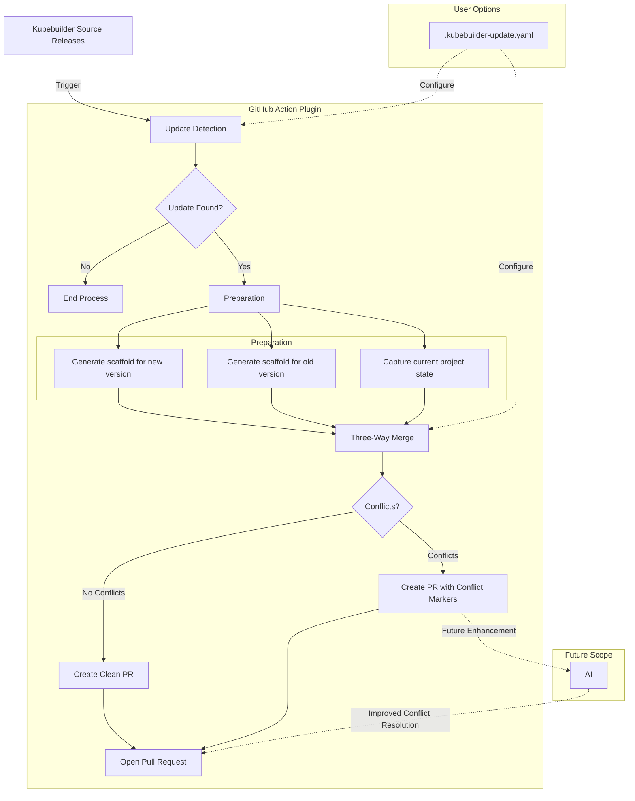
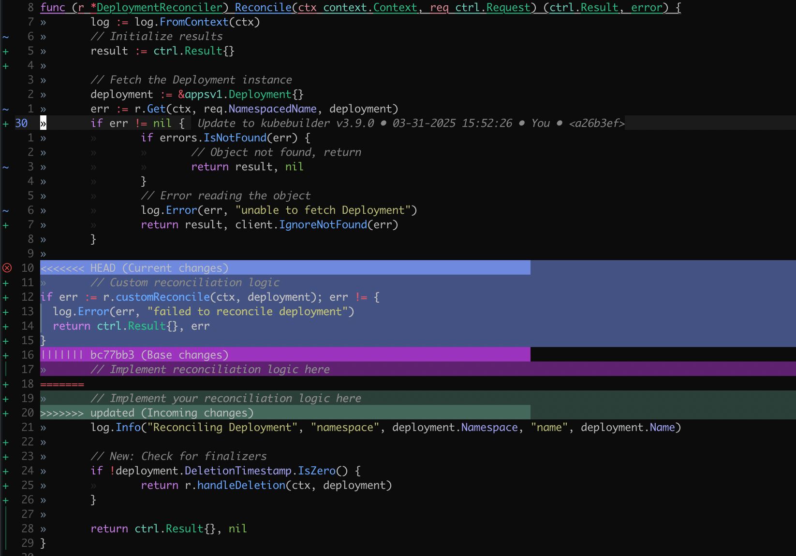

# Automating Operator Maintenance: Driving Better Results with Less Overhead

Proposal for Google Summer of Code (GSoC) 2025

- [Automating Operator Maintenance: Driving Better Results with Less Overhead](#automating-operator-maintenance-driving-better-results-with-less-overhead)
  - [Personal Details](#personal-details)
  - [Abstract](#abstract)
  - [Background](#background)
    - [The Maintenance Challenge](#the-maintenance-challenge)
    - [Impact of Outdated Scaffolds](#impact-of-outdated-scaffolds)
  - [About Me](#about-me)
  - [Technical Deep Dive](#technical-deep-dive)
    - [1. 3-Way Merge](#1-3-way-merge)
    - [2. AI-Assisted Conflict Resolution](#2-ai-assisted-conflict-resolution)
  - [Plan of Action](#plan-of-action)
    - [Phase 1: Core Functionality Implementation (Weeks 1-8)](#phase-1-core-functionality-implementation-weeks-1-8)
      - [Deliverables (Phase 1)](#deliverables-phase-1)
    - [Phase 2 (Weeks 9-12): Advanced Features \& AI Integration](#phase-2-weeks-9-12-advanced-features--ai-integration)
      - [Deliverables (Phase 2)](#deliverables-phase-2)
    - [Evaluation Metrics](#evaluation-metrics)
  - [UX Components:](#ux-components)
  - [Proof of Concept: Three-Way Merge in Action](#proof-of-concept-three-way-merge-in-action)
  - [Commitments](#commitments)
    - [Additional Information about the Timeline](#additional-information-about-the-timeline)
    - [Post-GSoC Plans](#post-gsoc-plans)


## Personal Details
|  |  |
| --- | --- |
| Name | Pranchal Shah |
| Email | pranchx@gmail.com |
| Location | Boston, Massachusetts, United States |
| Timezone | Eastern Time (US & Canada) |
| University | Northeastern University |
| Primary language | English |

## Abstract

Kubernetes operators built with Kubebuilder face a critical maintenance challenge: as the scaffolding framework evolves, projects struggle to stay current without tedious manual updates. This proposal introduces an automated three-way merge solution that seamlessly upgrades Kubebuilder projects while preserving customizations. By combining Git-aware merging strategies, conflict pattern recognition, and optional AI assistance, this approach generates pull requests that update scaffold code with minimal developer intervention. The resulting workflow not only reduces maintenance overhead but creates a more secure, sustainable ecosystem where Kubernetes operators can evolve alongside the rapidly changing cloud-native landscape.


## Background

Kubebuilder has emerged as the de facto standard for developing Kubernetes operators, providing a structured framework that abstracts away boilerplate code and enforces best practices. Since its introduction, it has evolved significantly, incorporating new Kubernetes APIs, controller-runtime improvements, and community-driven patterns that enhance operator stability and functionality.

### The Maintenance Challenge

While Kubebuilder excels at bootstrapping projects, it struggles with the "day two" problem: ongoing maintenance. When the framework releases new versions, projects face a difficult choice:

- **Remain on outdated scaffolds** - risking security vulnerabilities and missing performance improvements.
- **Manually re-scaffold and merge** - an error-prone, time-consuming process that often introduces regressions.
- **Start from scratch** - discarding valuable customizations and project history.

### Impact of Outdated Scaffolds

Outdated scaffolds aren't merely a cosmetic issue. They introduce concrete problems:

- Security vulnerabilities in deprecated dependencies.
- Incompatibility with newer Kubernetes APIs.
- Performance penalties from outdated controller patterns.
- Missed optimizations in error handling and reconciliation loops.
- Increasing divergence from community standards.

Each release cycle widens this gap, making eventual updates exponentially more difficult.

## About Me
Open-source software has always been more than just code to me - it represents a community of builders creating tools that impact millions of developers. My journey with Kubernetes began in 2023 when I implemented my first operator for managing custom database deployments during my internship.

What started as curiosity quickly turned into genuine enthusiasm for the ecosystem. I found myself diving deeper into Kubernetes internals, contributing to projects that seemed intimidating at first but became increasingly approachable as I spent more time with the community. The collaborative atmosphere and technical excellence I've encountered have only strengthened my commitment to meaningful contributions.

My contributions to the Kubernetes and Kubebuilder include:
- [#129574](https://github.com/kubernetes/kubernetes/pull/129574) (merged) - Add separate container runtime filesystem e2e tests, and some disk eviction scenarios
- [#34444](https://github.com/kubernetes/test-infra/pull/34444) (merged) - Update sig-node presubmit focus regex to match SeparateDisk tests
- [#34306](https://github.com/kubernetes/test-infra/pull/34306) (merged) - Add SeparateDisk flag to CI pipelines for testing infrastructure
- [#4713](https://github.com/kubernetes-sigs/kubebuilder/pull/4713) (merged) -  Fix hardcoded controller-runtime version in kubebuilder
- [#4720](https://github.com/kubernetes-sigs/kubebuilder/pull/4720) (open) - feat: Implement Bubbletea for Interactive CLI Prompts  

Previous experiences:
- Infrastructure intern at FoxyAI (Remote)
  - Architected infrastructure that processed 12M images/day for ML workloads
  - Implemented GitHub Actions workflows that reduced deployment time by 40%
  - Collaborated with distributed teams, strengthening my remote communication skills


I'm passionate about solving this specific problem because it represents a critical friction point that's holding back the entire Kubernetes operator ecosystem. By reducing the maintenance burden, we can enable developers to focus on building great solutions rather than wrestling with scaffold updates.

## Technical Deep Dive

### 1. 3-Way Merge
After researching Git's merge capabilities, I've found that three-way merges offer significant advantages over simple rebasing for Kubebuilder projects:
Why Three-Way Merge vs. Rebase:

- Rebasing loses the context of original changes
- Three-way merges preserve the intent of both original and updated code
- Better handling of parallel changes to the same files
- Provides clearer conflict markers showing all three versions

I'll implement the following Git configuration options to optimize the merge process:
```bash
# Shows all three versions in conflict markers (original, current, updated)
git config merge.conflictStyle diff3

# Remembers and reuses previous conflict resolutions
git config rerere.enabled true

# Improves detection of renamed/moved files
git config merge.renameLimit 999999
```

1. `merge.conflictStyle=diff3`: This is crucial because it shows the original base version alongside "ours" and "theirs" during conflicts. For Kubebuilder upgrades, seeing the original scaffold makes it much easier to identify what changed in both versions.
2. `rerere.enabled=true`: This makes Git "remember" how you resolved similar conflicts before. Since Kubebuilder updates often have patterns of similar changes across multiple files, this can dramatically reduce manual work.
3. `merge.renameLimit=999999`: This improves detection of renamed/moved files, which is common in Kubebuilder projects.
4. Custom Merge Driver Approach: For handling special file types, I'll create dedicated merge drivers:
    - YAML files (like kustomize configs)
    - The PROJECT file (needs special handling for version fields)
    - Go files with import blocks (common conflict source)


<!-- TODO: add this later ### Kubebuilder conflict pattern analysis -->
### 2. AI-Assisted Conflict Resolution
After researching current AI approaches for code merging, I believe GitHub Copilot offers the most promising path forward for this project:
Why GitHub Copilot:
- Already trained on millions of Go repositories
- Understands Kubernetes patterns and conventions
- Can analyze context from surrounding code
- Accessible via API (GitHub Copilot for Business)

Here's how I'd implement AI assistance for conflict resolution:
```go
// Pseudocode for AI-assisted conflict resolution
func resolveConflictWithAI(conflict ConflictMarker, surroundingCode string) (string, float64) {
  // Create a prompt that frames the conflict resolution task
  prompt := fmt.Sprintf(`
    I'm trying to resolve a merge conflict in a Kubebuilder project.
    
    The original code (BASE) is:
    %s
    
    Our current version (OURS) is:
    %s
    
    The updated scaffold (THEIRS) is:
    %s
    
    The surrounding code for context is:
    %s
    
    Please resolve this conflict by:
    1. Preserving our custom business logic
    2. Adopting the updated scaffold structure
    3. Merging imports and dependencies
    
    Provide only the resolved code without explanations.
    `, conflict.Base, conflict.Ours, conflict.Theirs, surroundingCode)
  
  // Send to LLM API
  resolution, confidence := callLLMAPI(prompt)
  
  return resolution, confidence
}
```
I'd implement this as an optional feature, since it requires API keys and may not be suitable for all environments. It would serve as a fallback when rule-based approaches fail.


## Plan of Action
The core of this proposal is a GitHub Action plugin that automates the process of updating a Kubebuilder project to a new version. Here is a high-level overview of the process:
<!-- TODO: add details like what will come from where, from the codebase, show that you understand the codebase-->



### Phase 1: Core Functionality Implementation (Weeks 1-8)

Week 1-2 : Research and architecture
- Deep dive into github's three-way merge capabilities
- Identify conflict patterns in kubebuilder projects
- Finalize architecture and design
- Establish evaluation metrics

Week 3-4 : Base Implementation
- Develop version detection and scaffold generation components
- Implement basic three-way merge functionality
- Create initial GitHub Action workflow structure
- Set up test repository for validation

Week 5-6: Merge Enhancement & Conflict Handling
- Develop custom merge strategies for Go files
- Implement semantic-aware merging for Kubebuilder-specific files
- Create conflict pattern detection and categorization
- Design conflict reporting and visualization

Week 7-8: Integration & Initial Testing
- Integrate all components into complete GitHub Action
- Develop configuration system via .kubebuilder-update.yaml
- Create PR templates with clear change summaries
- Perform testing across multiple Kubebuilder versions

#### Deliverables (Phase 1)
1. Functional GitHub Action that:
   - Detects new Kubebuilder releases
   - Generates scaffolds for original and new versions
   - Performs three-way merges
   - Creates PRs with change summaries
2. Documentation for setup and configuration
3. Test suite validating functionality across scenarios

### Phase 2 (Weeks 9-12): Advanced Features & AI Integration

Week 9-10: AI Conflict Resolution Research
- Research possible AI code conflict resolution
- Evaluate GitHub Copilot and other LLM-based resolution tools
- Create prototype integrations with selected AI tools
- Test AI resolution on common conflict patterns

Week 11-12: Kubebuilder Plugin & Refinement
- Define a `--output` directory and config for monorepos
- Develop Kubebuilder plugin that scaffolds the GitHub Action
- Implement extended configuration options
- Final documentation and polishing

#### Deliverables (Phase 2)
1. Research report on AI-assisted conflict resolution
2. Kubebuilder plugin (alpha feature) for easy Action setup
3. Enhanced conflict resolution strategies
4. Comprehensive documentation and examples

### Evaluation Metrics
I'll measure success using these metrics:
- Clean PR Rate: Percentage of PRs generated without conflicts
- Conflict Resolution Rate: Percentage of conflicts that can be automatically resolved
- Time Savings: Average time saved compared to manual updates
- Test Pass Rate: Percentage of generated PRs that pass all tests
- Adoption Rate: Number of projects using the tool

## UX Components:
I've designed how the PR experience will look for maintainers, focusing on clarity and actionability:

```md
# Kubebuilder Update: v4.4.3 → v4.5.0

## 🌟 What's New
- **Feature A** _(from Kubebuilder release notes)_
- **Feature B** _(extracted from changelog)_
- **Bug fix C** _(from GitHub release page)_

## ✅ Changes Overview
- **15 files modified** _(calculated from Git diff)_
- **3 files with conflicts** _(detected three-way merge)_

## ⚠️ Conflict Details
### 🔄 Auto-Resolved Conflicts
- `file1.go`: **Dependency version update** _(pattern match: version string updates)_
- `file2.go`: **Formatting change** _(pattern match: whitespace-only changes)_

### 🔧 Needs Review
- `file3.go`: **API change conflict**
  - **Original:** `[code snippet from v4.4.3 scaffold]`
  - **Updated:** `[code snippet from v4.5.0 scaffold]`
  - **Current solution:** `[merged result with highlighted conflict areas]`
  - **Suggested resolution:** `[recommendation based on pattern recognition]`

```
The PR description focuses on providing a clear summary of what's changed and highlighting exactly where human attention is needed. This saves developers time by directing them straight to conflict areas.

```go
@@@ -120,26 -120,20 +120,31 @@@
 func (r *DeploymentReconciler) Reconcile(ctx context.Context, req ctrl.Request) (ctrl.Result, error) {
   log := log.FromContext(ctx)
-  
+  // Initialize results
+  result := ctrl.Result{}
+
   // Fetch the Deployment instance
   deployment := &appsv1.Deployment{}
-  if err := r.Get(ctx, req.NamespacedName, deployment); err != nil {
+  err := r.Get(ctx, req.NamespacedName, deployment)
+  if err != nil {
    if errors.IsNotFound(err) {
       // Object not found, return
-      return ctrl.Result{}, nil
+      return result, nil
     }
     // Error reading the object
-    return ctrl.Result{}, err
+    log.Error(err, "unable to fetch Deployment")
+    return result, client.IgnoreNotFound(err)
   }
 
+<<<<<<< OURS (Current Project)
   // Custom reconciliation logic
   if err := r.customReconcile(ctx, deployment); err != nil {
     log.Error(err, "failed to reconcile deployment")
     return ctrl.Result{}, err
   }
+||||||| BASE (v3.8.0)
+  // Implement reconciliation logic here
+  log.Info("Reconciling Deployment", "namespace", deployment.Namespace, "name", deployment.Name)
+=======
+  // Implement your reconciliation logic here
+  log.Info("Reconciling Deployment", "namespace", deployment.Namespace, "name", deployment.Name)
+  
+  // New: Check for finalizers
+  if !deployment.DeletionTimestamp.IsZero() {
+    return r.handleDeletion(ctx, deployment)
+  }
+>>>>>>> THEIRS (v3.9.0)
 
   return ctrl.Result{}, nil
 }
```

The three-way diff format clearly shows:
- What was in the original scaffold (BASE)
- What's in the current project with customizations (OURS)
- What's in the new scaffold version (THEIRS)

This makes it much easier for developers to make informed decisions about which parts to keep.


## Proof of Concept: Three-Way Merge in Action
To validate the technical approach, I've created a working proof-of-concept demonstrating how the three-way merge preserves customizations while applying scaffold updates: [link to POC repo](https://github.com/p-shah256/poc-gsoc-kubebuilder). The POC simulates:
- A base Kubebuilder project (v3.8.0)
- A customized version with business logic added
- An updated scaffold (v3.9.0) with new patterns

When the three-way merge runs, it automatically:

- Updates the non-conflicting parts (PROJECT file version, improved error handling)
- Identifies conflicts between customizations and scaffold changes
- Preserves both the custom code and the updated scaffold structure

Here's what the conflict resolution looks like in practice:
``` go
@@@ -21,25 -21,36 +21,46 @@@ type DeploymentReconciler struct 
 // Reconcile is part of the main kubernetes reconciliation loop
 func (r *DeploymentReconciler) Reconcile(ctx context.Context, req ctrl.Request) (ctrl.Result, error) {
 	log := log.FromContext(ctx)
-	
+	// Initialize results
+	result := ctrl.Result{}
+
 	// Fetch the Deployment instance
 	deployment := &appsv1.Deployment{}
-	if err := r.Get(ctx, req.NamespacedName, deployment); err != nil {
+	err := r.Get(ctx, req.NamespacedName, deployment)
+	if err != nil {
 		if errors.IsNotFound(err) {
 			// Object not found, return
-			return ctrl.Result{}, nil
+			return result, nil
 		}
 		// Error reading the object
-		return ctrl.Result{}, err
+		log.Error(err, "unable to fetch Deployment")
+		return result, client.IgnoreNotFound(err)
 	}

+<<<<<<< HEAD
+	// Custom reconciliation logic
+if err := r.customReconcile(ctx, deployment); err != {
+  log.Error(err, "failed to reconcile deployment")
+  return ctrl.Result{}, err
+}
+||||||| bc77bb3
+	// Implement reconciliation logic here
+=======
+	// Implement your reconciliation logic here
+>>>>>>> updated
 	log.Info("Reconciling Deployment", "namespace", deployment.Namespace, "name", deployment.Name)
```
I've created a working POC demonstrating the three-way merge approach at [link to POC repo](https://github.com/p-shah256/poc-gsoc-kubebuilder). You can clone the repo and run `./merge-update.sh` to see how the system preserves customizations while applying scaffold updates. The conflict visualization clearly shows how custom code and scaffold improvements can be merged intelligently.


This demonstration proves the viability of using three-way merges to update Kubebuilder projects. The full implementation would automate the remaining steps:
1. Generating the original scaffold from the recorded version
2. Generating the updated scaffold with the latest Kubebuilder release
3. Creating a PR with these changes and clear documentation of conflicts

The POC confirms that the approach preserves custom code while allowing adoption of improved scaffolding patterns with minimal manual intervention.

## Commitments

During weekdays (Monday through Friday), I will be able to dedicate 3-5 hours to project work, ensuring alignment with EST working hours. This allows for efficient communication and collaboration. To compensate for the reduced weekday schedule, I'm happy to invest additional hours on weekends (Saturday and Sunday) – typically 7-8 hours per day. This extended weekend commitment ensures I meet the proposed timeline while respecting the time zone difference.

### Additional Information about the Timeline

The timeline mentioned above is subject to change and is only an approximate outline of my project work. I will stick to or exceed this schedule and create a more detailed schedule during the pre-GSoC and community bonding phase.
I've no other commitments during the summer and can dedicate 30 to 35 hours a week.
Time will be divided (according to workload) each week amongst planning, learning, coding, documenting and testing features. All documentation will go hand in hand with the development.

### Post-GSoC Plans
I plan to continue contributing to kubernetes ecosystem after GSoC and beyond this single project. I've already found a home in the Kubebuilder community through my existing contributions, and plan to give the best possible outcome for this automated maintenance solution while tackling other challenging problems in the operator ecosystem. The relationships built during GSoC and the deeper understanding of Kubebuilder's internals will position me to make meaningful long-term contributions, whether enhancing this specific tool or addressing other pain points that emerge in the rapidly evolving cloud-native landscape.

My vision for this plugin is that it will run with minimal overhead of attention and time from the people building custom operators.